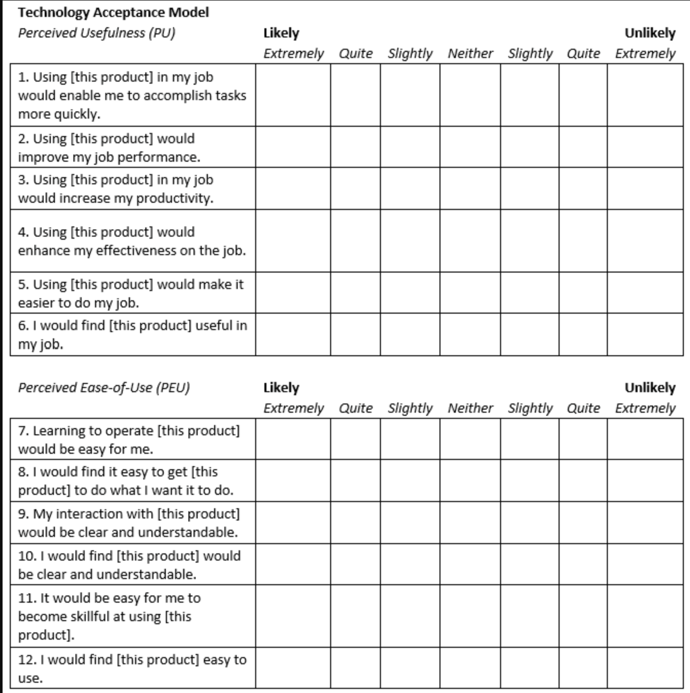

# Evaluation Chapter Skeleton

## Controlled experiments (objective performance):
- Repair success rate
- Detection accuracy
- Recovery time
- Number of repair iterations

## Ablation study:
- Remove validator
- Remove repair agent
- Remove runtime feedback
- Compare performance

## User study:
- Participants perform identical debugging tasks
- Measure completion time and success
- Administer SUS, TAM, and NASA-TLX questionnaires

## Examples for Survey

- 
- [SUS](https://feedback.surveylab.com/pageTag/SurveyCampaign/cId/9a4e73bf82b9ef8f769e7422f6c654b631de0dcf/)
- [NASA TLX](https://ixdf.org/literature/topics/task-load)
